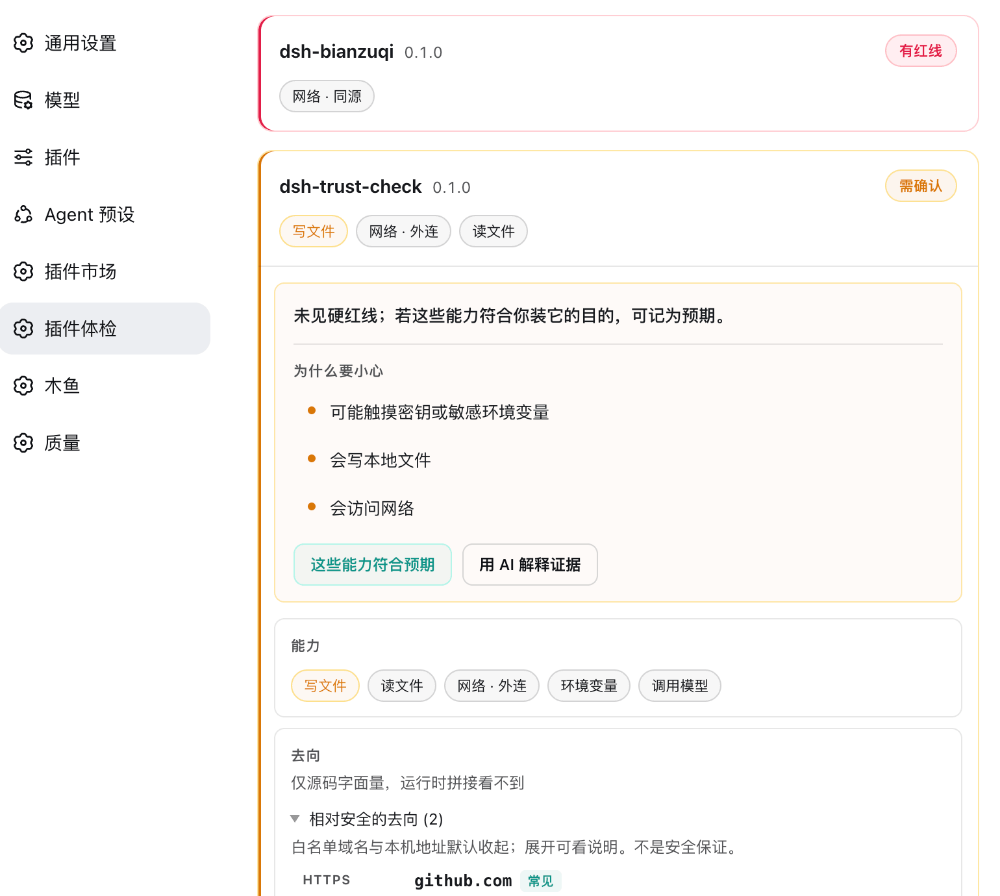
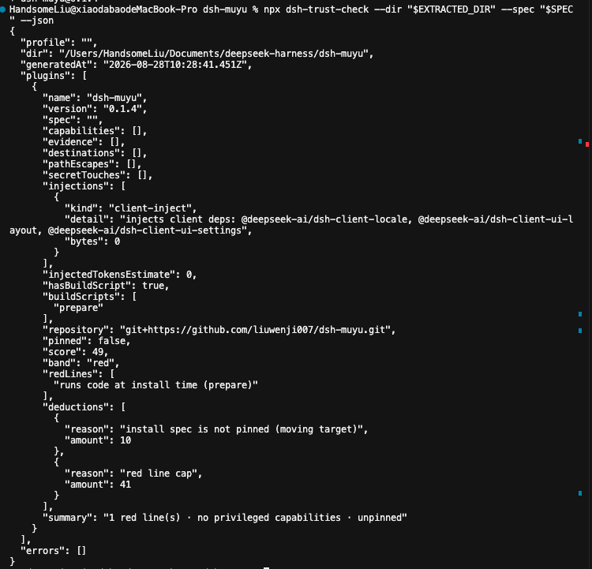

# dsh-trust-check

[中文](README.md)

Static trust audit for DeepSeek Harness plugins: **capability disclosure** for permissions, injections, source, and install scripts — code-judged, reproducible, zero tokens.

> Not an antivirus, and it makes no safety promises. It proves only what is provable: what a plugin really touches, what it injects, and whether its source can be checked — with evidence (file + line + snippet) for every claim, so you can verify it yourself.

## Install

**The settings UI needs dsh ≥ 0.1.0-rc.8 (recommend 0.1.1-rc.2).** The Web UI depends on `@deepseek-ai/dsh-client-store` in the host module table. The market will not block a mismatched install; on an older host the settings page fails to load (`dsh-client-store` missed the module table).

**The CLI does not need a DSH host** — `npx dsh-trust-check` still works on older dsh.

Check the host first (settings UI only):

```sh
dsh --version
# if too old: npm i -g @deepseek-ai/dsh@latest
```

```sh
dsh plugin --profile web add dsh-trust-check
```

Restart `dsh web`, then open **Settings → Plugin Trust**. Already installed: update from Plugin Market, or `dsh plugin --profile web add dsh-trust-check@latest`, then restart.

A standalone CLI is also provided, independent of the DSH host:

```sh
npx dsh-trust-check                 # audit the default profile `web`
npx dsh-trust-check --profile work  # audit another profile
npx dsh-trust-check --json          # machine-readable output

# Audit any extracted package directory (no profile, no DSH)
npx dsh-trust-check --dir ./path/to/plugin
npx dsh-trust-check --dir ./pkg --spec npm:foo@1.0.0 --json
```

`--dir` and `--profile` are mutually exclusive. Both modes emit the same `AuditResponse` shape for `--json`: `{ profile, dir?, generatedAt, plugins, errors }`; in single-directory mode `profile` is an empty string and `dir` is the absolute path.

| Settings → Plugin Trust | CLI `--dir --json` |
| --- | --- |
|  |  |

### Troubleshooting

| If | Then |
| --- | --- |
| Settings: `dsh-client-store` missed the module table | Host too old: upgrade **dsh ≥ 0.1.0-rc.8**, restart Web; use the CLI above for audits in the meantime |
| No “Plugin Trust” in Settings | Confirm `add` + restart; or the client failed to load on an old host |

## How to read the report

The settings UI and CLI use a **decision-first** layout. Reading order:

1. **Decision**: badge + action line + "why be careful" (up to 3 bullets)
2. **Scan**: capability chips → injection summary (collapsed) → source
3. **Evidence**: grouped by capability, collapsed by default

| Verdict | Meaning | When |
|---|---|---|
| **Red line(s)** | Hard red line hit; stop by default — or confirm risk to keep using | `redLines` non-empty, current fingerprint not acknowledged |
| **Risk accepted** | You confirmed the current red-line risk | Has red lines, `trust-ack.json` matches this scan |
| **Review** | No hard red lines, but privileged capabilities or patch changes | Has capabilities or override/disable, no red lines |
| **As expected** | You acknowledged the current capability/shape fingerprint | `trust-ack.json` matches this scan (no red lines) |
| **Nothing detected** | No red lines or privileged capabilities — not a safety guarantee | Everything else |

`score` / `summary` stay in JSON for sorting and integrators; the settings UI does not show them. Injected token estimates are labeled as **cost hints** only.

### Shape layer (code-judged)

Besides capability chips, the report extracts three kinds of literal facts from source:

- **Literal destinations**: URL / host / IP. Same-origin HTTP routes (e.g. `/dsh-market/check`) do not count as destinations.
- **Workspace path escapes**: absolute paths, home directory, traversal, …
- **Secret touches**: paths, sensitive env names.

These mean "we saw this string in source", not "this address/path is safe"; runtime-built URLs are invisible.

**Allowlist**: common host / registry domains (GitHub, npm, npmmirror, Tencent Cloud mirrors, …), the curated DSH catalog and GitHub proxies, and common model-vendor APIs (DeepSeek, OpenAI, Anthropic, Google Gemini). Allowlisted entries are collapsed by default with a short note; plaintext HTTP is never downgraded by the allowlist.

**Noise reduction and truncation**:

- Skips IP range tables (e.g. SSRF private-IP checks), placeholder bases like `http://local` / `http://dsh.invalid`, RFC 2606 `.example` / `.invalid` / `.test`, and shell switches (`/c`).
- Comments are blanked before the scan, so an example URL in a JSDoc block is not a destination (bundlers usually keep those comments).
- Namespace identifiers such as `xmlns="http://www.w3.org/2000/svg"` are excluded by exact host — an attacker cannot register those domains, so the exemption cannot be borrowed.
- When findings exceed the cap, the riskiest are kept: plaintext HTTP and literal IPs cannot be crowded out by harmless addresses.
- Secret paths require path shape (`/id_rsa`, `~/.netrc`); deny-list regex strings or `startsWith('id_rsa')` are not credential access.

### Mark as expected

After you confirm capabilities match why you installed the plugin, the fingerprint is stored in `~/.dsh/profiles/<profile>/trust-ack.json`. An upgrade that changes capabilities / destinations / path escapes / secrets / injections (including skill text size) returns to **review**. Accepting a red line goes through its own "confirm risk" action, which a plain mark-as-expected request cannot stand in for.

**AI explain**: optional button; uses your DSH-configured model to explain the report summary only, **does not change the verdict**; unavailable when no model is configured.

### Red lines (default block)

1. declares install/postinstall/preinstall/**prepare** scripts;
2. `cordis.patch.yml` overrides/disables an `@deepseek-ai/*` core bundle (matched by `id` **or** `name`);
3. reads credential/secret material (keychain / keytar / dotenv / `~/.ssh` / `.aws/credentials` …) **and** has network access;
4. plaintext `http://` to non-localhost (literal) **and** has network;
5. non-loopback literal IP outbound **and** has network.

Red lines cap the numeric score at 49 (avoiding "100 + high risk"). **The verdict follows `redLines`, not the score**: a low score (e.g. 9) can come from shell + network + unpinned spec stacking and should show **review**, not red line(s). JSON `band` may still be `red` (score below 50), but UI/CLI use `verdict()` — do not mix them.

## What it audits

| Dimension | Reads | Judgement |
|---|---|---|
| **Capabilities** | `package.json` dependency scopes + static scan of `lib/`, `dist/`, `bin/`, `scripts/`, skill dirs, and `main` / `exports` / `bin` entry files | shell / file read / file write / network / credentials / sub-agents / LLM calls / env reads |
| **Injections** | `cordis.patch.yml` + `systemPrompt` / `ctx.skills.register` / `system-prompt/assemble` + skill text | who it overrides/disables (`id` or `name`), what it injects |
| **Cost** | skill text + system-prompt inline literal bytes | estimated injected tokens per request (bytes / 4, estimate only) |
| **Source** | `package.json` `repository` (falls back to the git install source) + install spec | pinned version / pinned commit |
| **Update risk** | install scripts (install/postinstall/preinstall/prepare) | arbitrary code at install time |

## For integrators (e.g. dsh-market)

Stable exports for pre-install confirmation or CI gates:

```ts
import { auditPlugin, collectPlugin, verdict } from 'dsh-trust-check'

const report = auditPlugin(collectPlugin(extractedDir, spec))

// Gate semantics (fixed — copy into market confirm dialog):
// verdict(report) === 'red'    → block by default; user may confirm to continue
// verdict(report) === 'review' → show capability list; suggest confirm
// verdict(report) === 'clear'  → may pass silently
```

CLI equivalent (market can spawn without DSH):

```sh
npx dsh-trust-check --dir "$EXTRACTED_DIR" --spec "$INSTALL_SPEC" --json
```

Parse `--json` uniformly: `plugins[0]` for single `--dir`, or the full `plugins` array for profile mode; non-empty `errors` means the directory could not be read.

**Out of scope for this release**: remote tarball download (market's job). Workflow: extract to a temp dir, then `--dir`.

## Principles

- **Code-judged, not LLM-scored**: every judgement is code, zero tokens, reproducible.
- **Proves presence, never absence**: static analysis only claims "detected X"; it never claims "guaranteed no Y".
- **Evidence you can re-check**: every capability hit carries `file:line` and a snippet.
- **Hot-swappable seam table**: detection rules are a data table (`src/core/seams.ts`); DSH API changes mean editing the table, not the engine.

## Known limits

- **Post-install checkup**: profile mode audits plugins **already installed**; install/postinstall/prepare may have run before your first scan. `--dir` can scan an extracted tree before install (but install scripts may still run during market extract/install).
- Static scans miss/false-positive (runtime-loaded capabilities are invisible; dynamic `import('node:' + …)`, string concatenation, and obfuscated `eval`/`Function` can still bypass the rule table).
- **Does not scan `node_modules`**: dependency behavior is out of scope.
- Client-side `fetch('/api')` same-origin calls are still flagged as network; the chip is labelled same-origin or outbound, but a missing outbound literal is not a proof of no outbound access, and the score is unchanged.
- Injected tokens are a byte / 4 estimate, not exact billing.
- `link:` / `file:` installs can't infer source from the spec; if the package.json lacks `repository`, it shows "no repository declared".
- The `repository` field is self-declared; it is not cross-checked against the npm package name, and a non-`http(s)` scheme is never rendered as a clickable link.

## Development

```sh
pnpm install
pnpm build       # tsdown: node half → lib/index.js, client half → lib/client.js
pnpm test        # vitest, covers the core engine
pnpm typecheck   # tsc --noEmit
```

Rule-table and allowlist contributions: [CONTRIBUTING.md](CONTRIBUTING.md). Allowlist PRs are reviewed harder than rule PRs — an allowlist entry weakens detection, and plaintext HTTP is never downgraded by the allowlist. The attack classes rules are held against, and the three limits of static analysis, are in [THREAT-MODEL.md](THREAT-MODEL.md).

## Roadmap

- v1 (current): installed-plugin audit + CLI `--dir` + Web dimension-first report
- v2: PR to dsh-market for install confirmation (this package provides `--dir` / `auditPlugin` contract)
- v3: the data layer for Agent CI — "did this plugin's behavior drift on upgrade" regression assertions

## License

MIT
